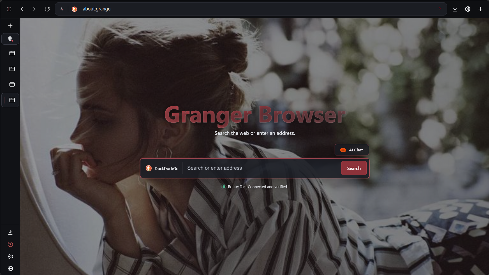
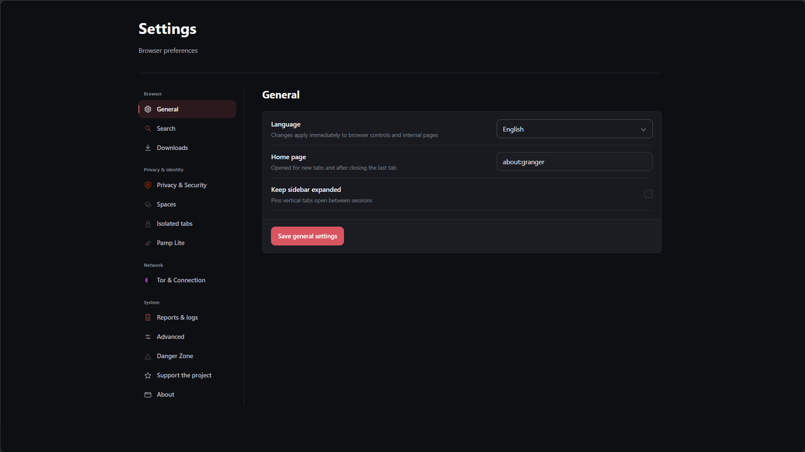

<div align="center">

# Granger Browser

### Privacy-focused Windows browser with integrated Tor and I2P, isolated browsing environments and built-in privacy controls.

Native C++20 · Qt 6 · Chromium · Tor · I2P

<br>

[](https://github.com/zakhar-git/Granger-Browser/releases/latest)
[](#build-from-source)
[](#technology)
[](#project-status)
[](#tor)

<br>

**[Download latest build](https://github.com/zakhar-git/Granger-Browser/releases/latest)** ·
**[Build from source](BUILDING.md)** ·
**[Security](SECURITY.md)** ·
**[Documentation](docs/)**

</div>

---

<p align="center">
  
</p>

## What is Granger?

**Granger Browser** is a native privacy-oriented desktop browser for Windows.

It is built with **C++20, Qt Widgets and Qt WebEngine**, using Chromium as the underlying web engine while adding its own privacy controls, managed Tor and I2P routing, isolated browsing environments, site permissions, content filtering and native desktop UI.

Granger is designed around a simple principle:

> **Privacy features should be visible, controllable and measurable — not hidden behind a single "private mode" switch.**

Granger does **not** claim to provide perfect anonymity, make a device untraceable or eliminate every form of browser fingerprinting.

It is an actively developed browser and should currently be treated as **beta software**.

---

## Highlights

<table>
<tr>
<td width="50%" valign="top">

### 🧅 Integrated Tor

Managed Tor routing directly inside the browser.

Supports:

- Tor without a bridge
- obfs4
- WebTunnel
- Snowflake
- meek_lite
- vanilla bridges
- external Tor SOCKS
- upstream SOCKS
- upstream HTTP CONNECT

No verified privacy route means browsing is not silently downgraded to a direct connection.

</td>
<td width="50%" valign="top">

### 🛡 Privacy Controls

Configurable protection for several browser surfaces, including:

- WebRTC
- Canvas
- WebGL
- storage
- cookies
- permissions
- scripts
- WebAssembly
- Referer
- tracking parameters
- Global Privacy Control

</td>
</tr>

<tr>
<td width="50%" valign="top">

### 🧩 Isolated Spaces

Separate browsing environments built around independent WebEngine profiles.

Spaces can isolate:

- cookies
- sessions
- cache
- local storage
- authentication state
- browsing identity

Useful when multiple identities should not share the same browser state.

</td>

<td width="50%" valign="top">

### 🚫 Content Blocking

Local blocking and privacy filtering based on maintained rule sets.

Includes support for:

- EasyList
- EasyPrivacy
- cosmetic filtering
- tracking domains
- tracking URL parameters
- custom blocked domains

Visited URLs are not sent to a remote filtering service just to decide whether a request should be blocked.

</td>
</tr>

<tr>
<td width="50%" valign="top">

### 🔐 Site Controls

Per-origin controls for sensitive browser capabilities.

Depending on the current configuration, site controls can cover:

- JavaScript
- WebAssembly
- WebGL
- cookies
- WebRTC
- autoplay
- permissions
- storage behavior

</td>

<td width="50%" valign="top">

### 🖥 Native Desktop UI

Granger is not an Electron shell.

The interface includes:

- vertical tabs
- collapsible sidebar
- Spaces
- downloads
- history
- bookmarks
- settings
- session restoration
- Tor status
- internal privacy pages

</td>
</tr>
</table>

---

## Screenshots

### Browser

<p align="center">
  
</p>

### Settings

<p align="center">
  
</p>

---

## Download Granger Browser

### Windows Installer — Recommended

### **[Download GrangerSetup.exe](https://github.com/zakhar-git/Granger-Browser/releases/latest/download/GrangerSetup.exe)**

The easiest way to install Granger Browser:

1. Download `GrangerSetup.exe`.
2. Run it.
3. The installer downloads and verifies the current Windows x64 runtime.
4. Launch Granger Browser.

GrangerSetup is a native per-user bootstrap installer. It downloads the complete browser runtime from the official Granger Browser GitHub Release, verifies its SHA-256 checksum, and installs it under `%LOCALAPPDATA%\Programs\Granger Browser`.

No manual Qt, Visual C++, Python, Tor, or additional DLL installation is required.

### Portable

Download `Granger-Browser-vX.X.X-windows-x64.zip` from **[GitHub Releases](https://github.com/zakhar-git/Granger-Browser/releases/latest)**, verify `SHA256SUMS.txt`, extract the entire archive, and run `GrangerBrowser.exe`.

The installer and portable download use the same complete Qt, WebEngine, ICU, Visual C++ and Tor runtime package. See [docs/INSTALLER.md](docs/INSTALLER.md) for installer architecture and rebuild details.

> **Do not download GitHub's automatically generated `Source code (zip)` or `Source code (tar.gz)` if you only want to run Granger.**
>
> Those archives contain the repository source tree, not the supported portable Windows package.

---

## Supported Platforms

| Platform | Status |
|---|---|
| Windows 11 x64 | Primary target |
| Windows 10 x64 | Supported target, testing coverage may vary |
| Windows ARM64 | Not currently provided |
| Windows x86 | Not supported |
| Linux | Not currently supported |
| macOS | Not currently supported |
| Windows 7 / 8 / 8.1 | Not supported |

Granger currently ships as a **Windows x64 browser**.

Cross-platform support may be considered later, but the current codebase and release pipeline are focused on modern 64-bit Windows systems.

---

## Project Status

> **Granger Browser is currently beta software.**

The project is under active development.

Some privacy behavior, user interface components, internal architecture and compatibility behavior may change between releases.

Current releases should not be treated as a finished security product.

### Known issue

On at least one physical **Windows 11 x64** system, Granger has reproduced a Qt WebEngine renderer failure where browser tabs display:

```text
Tab crashed
```

The main application itself launches, but the renderer subprocess may terminate.

This issue is under investigation.

Because hardware, graphics drivers, Windows runtime state and WebEngine behavior vary between systems, a successful launch on one Windows installation does not guarantee identical behavior on every machine.

If you encounter this issue, please include:

- Windows version
- CPU/GPU
- Granger version
- whether every tab crashes or only specific pages
- any relevant logs

when reporting it.

---

## Tor

Granger includes managed Tor support instead of treating Tor as a simple boolean status.

Connection state is conceptually separated into:

```text
Configuration
      ↓
Tor process
      ↓
Bootstrap
      ↓
Browser route verification
      ↓
Connected
```

Granger should not report a verified connection merely because `tor.exe` started successfully.

Supported connection strategies currently include:

- Tor without a bridge
- obfs4
- WebTunnel
- Snowflake
- meek_lite
- vanilla bridges
- external Tor SOCKS
- upstream SOCKS
- upstream HTTP CONNECT

Bridge input is preserved for generated Tor configuration while the application also parses transport information for validation and UI state.

A bridge may be syntactically valid and still fail because the bridge is offline, blocked or unreachable.

That condition is reported as an actual connection failure rather than silently falling back to a direct browser connection.

---

## Private network routing

Tor is the default preferred privacy network. The Windows package contains Tor
0.4.9.11 from the signed Tor Expert Bundle 15.0.20. I2P is bundled as a managed
secondary backend using official PurpleI2P i2pd 2.61.0. Network preference is
not a direct-mode switch: Granger keeps a local fail-closed gateway in front of
Qt WebEngine and only opens it for a verified private route.

- `.onion` destinations require verified Tor.
- `.i2p` destinations require verified I2P.
- Human-readable `.i2p` names use i2pd's local address book; they never fall back to system DNS.
- Clearnet uses verified Tor.
- Clearnet is blocked on I2P because the bundled configuration has no verified outproxy.
- If both backends are unavailable, browsing remains blocked.

Tor and I2P have different threat models. Neither this routing policy nor the
browser's fingerprinting defenses are a guarantee of anonymity. See
[private network routing](docs/PRIVATE_NETWORK_ROUTING.md) for the state machine,
runtime source, and fail-closed boundary.

---

## Privacy Model

Granger follows several broad principles:

### Standardize where possible

Reducing variation can be preferable to generating random fingerprint values.

Randomizing every browser surface can make a browser more unique rather than less identifiable.

### Minimize exposed information

Unnecessary APIs and identifying surfaces should expose as little useful entropy as reasonably possible.

### Isolate identities

Separate profiles and Spaces are intended to reduce cross-session and cross-identity state sharing.

### Fail closed for protected routing

A failure in the configured privacy route should not silently convert protected browsing into normal direct browsing.

---

## Privacy Features

Depending on the active configuration, Granger includes protection and controls for:

- WebRTC exposure
- Canvas extraction
- WebGL
- WebGPU
- audio fingerprinting surfaces
- hardware information
- screen geometry normalization
- timezone and locale
- plugins
- MIME types
- media device enumeration
- third-party cookies
- storage
- tracking URL parameters
- Global Privacy Control
- Referer reduction
- permissions
- script execution
- WebAssembly
- local site policies

Exact behavior can change as privacy work continues.

Granger intentionally does **not** claim that these protections make every user indistinguishable from every other browser user.

---

## Spaces

Spaces provide separate browser identities using independent WebEngine profiles.

A Space can maintain its own:

- tabs
- cookies
- cache
- authentication
- storage
- browsing state

Moving a tab between Spaces requires creating it under the target profile rather than simply reusing the same WebEngine identity.

This is designed to provide stronger separation than a purely visual tab grouping system.

---

## Search

Built-in search provider support includes:

- DuckDuckGo
- Google
- Bing
- Brave Search
- Startpage
- Mojeek
- Onion Search through Ahmia

Search suggestions are disabled by default.

When enabled, suggestions necessarily send the typed search prefix to the selected suggestion provider.

---

## Compatibility Profiles

Granger can expose compatibility-oriented User-Agent profiles, including:

- Chromium default
- Firefox-compatible
- Chrome-compatible
- custom User-Agent

These profiles are intended for compatibility testing.

> Changing the User-Agent does **not** change the underlying engine.

Granger remains a Qt WebEngine / Chromium browser.

TLS behavior, Client Hints, codecs, rendering behavior and many other engine-level surfaces may still identify Chromium.

---

## Data Storage

Mutable browser data is stored outside the portable package under:

```text
%LOCALAPPDATA%\Granger\Granger Browser\
```

This can include:

- browser profile
- cache
- persistent state
- history
- bookmarks
- download history
- logs
- Tor data
- generated Tor configuration
- I2P router state and generated I2P tunnel configuration

Test infrastructure can use custom data roots through supported development environment variables.

---

## Technology

Granger currently uses:

| Component | Technology |
|---|---|
| Language | C++20 |
| Desktop UI | Qt Widgets |
| Browser engine | Qt WebEngine / Chromium |
| Qt | 6.11.2 |
| Networking privacy | Managed Tor and bundled I2P |
| Build system | CMake |
| Primary compiler | MSVC 2022 x64 |
| Primary platform | Windows x64 |

Qt WebEngine is Chromium-based, but Granger is not Chromium itself and does not claim feature parity with Chrome, Chromium, Firefox, Tor Browser or Mullvad Browser.

---

## Build from Source

### Requirements

- Visual Studio 2022
- MSVC x64 toolchain
- CMake 3.24+
- Qt 6.11.2

Required Qt modules include:

- Widgets
- Svg
- Network
- WebEngineWidgets
- WebChannel
- Positioning

Build and package:

```powershell
.\scripts\build-release.ps1 `
    -QtRoot "$env:USERPROFILE\Qt\6.11.2\msvc2022_64"
```

For complete instructions, see:

**[BUILDING.md](BUILDING.md)**

The repository contains source code and build tooling.

The end-user portable build is distributed separately through **GitHub Releases**.

---

## Repository Structure

```text
Granger-Browser/
├── granger/          # Main Granger Browser source
├── pamp/             # Pamp source
├── scripts/          # Build and packaging tooling
├── tests/            # Automated tests
├── third_party/      # Vendored third-party components
├── docs/             # Technical documentation
├── screen/           # README screenshots
├── CMakeLists.txt
├── BUILDING.md
├── DISTRIBUTION.md
├── SECURITY.md
└── README.md
```

Generated build directories and packaged runtime binaries are intentionally excluded from `main`.

---

## Security Limitations

Granger is a privacy-oriented browser, not a proof of anonymity.

Important limitations include:

- No browser can eliminate all fingerprinting techniques.
- Tor does not protect against every endpoint, account or behavioral correlation attack.
- I2P and Tor provide different routing properties and are not interchangeable anonymity guarantees.
- Logging into an identifying account can identify the user regardless of network routing.
- Browser compatibility may require exposing some APIs.
- User-Agent spoofing alone does not hide the underlying browser engine.
- Some websites may block Tor exits.
- CAPTCHAs and anti-bot systems may behave differently over Tor.
- Bridges can become unavailable or blocked.
- A compromised operating system can defeat browser-level privacy protections.
- Extensions, downloaded files and external applications may create additional privacy risks.
- Cross-device fingerprint uniformity is not assumed without testing across multiple physical systems.

Do not interpret Granger's privacy controls as a guarantee against identification.

---

## Windows Security Warnings

Current public binaries may not be digitally code-signed.

Windows SmartScreen or other security software may therefore display an **Unknown publisher** warning.

Always download Granger from the official repository release page and verify the published SHA-256 checksum when available.

Do not download replacement Granger DLL files from third-party DLL websites.

---

## Reporting Bugs

Bug reports are especially useful when they include:

```text
Granger version:
Windows version:
CPU:
GPU:
Connection mode:
Tor strategy:
Steps to reproduce:
Expected result:
Actual result:
Logs/screenshots:
```

Please avoid publishing private browsing data, authentication tokens, bridge credentials or other sensitive information in public issues.

Security-sensitive reports should follow **[SECURITY.md](SECURITY.md)**.

---

## Development

Granger is actively developed and the internal design is still evolving.

Contributions, technical review, compatibility testing and reproducible bug reports are welcome where appropriate.

Before changing privacy-sensitive code, understand the existing routing and isolation model.

In particular, changes must not introduce a silent direct-network fallback when a protected route fails.

---

## License Status

There is currently **no project-wide open-source license grant** for Granger Browser's project-authored source code.

The repository is publicly readable, but public availability alone does not grant permission to copy, modify, redistribute or relicense project-owned source code.

Third-party components retain their own licenses and attribution requirements.

See:

- [NOTICE.txt](NOTICE.txt)
- [DISTRIBUTION.md](DISTRIBUTION.md)
- `third_party/`

for additional information.

---

## Disclaimer

Granger Browser is provided for legitimate privacy, research, development and general browsing purposes.

The project is under active development.

No guarantee is made regarding:

- anonymity
- uninterrupted Tor availability
- compatibility with every website
- compatibility with every Windows configuration
- resistance to all fingerprinting methods
- protection against a compromised host operating system

Users are responsible for understanding the limitations of the software and their own threat model.

---

<div align="center">

## Granger Browser

**Privacy is a system, not a switch.**

C++20 · Qt 6 · Chromium · Tor

<br>

[Download](https://github.com/zakhar-git/Granger-Browser/releases/latest)
·
[Build](BUILDING.md)
·
[Security](SECURITY.md)
·
[Issues](https://github.com/zakhar-git/Granger-Browser/issues)

</div>
