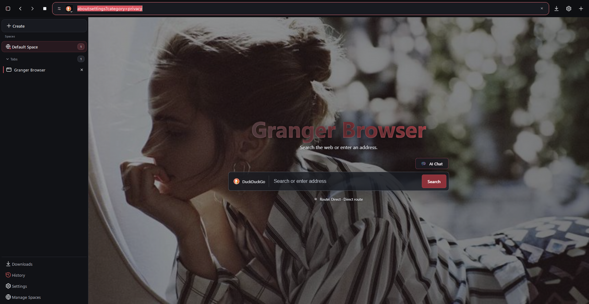
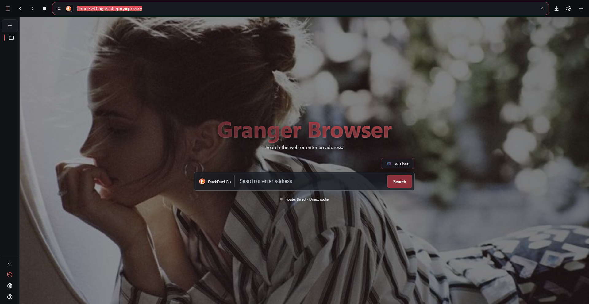
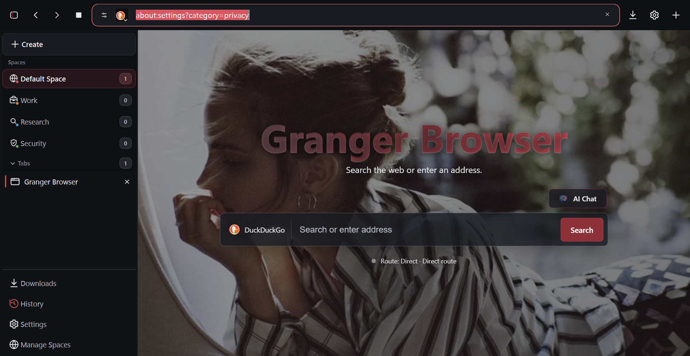
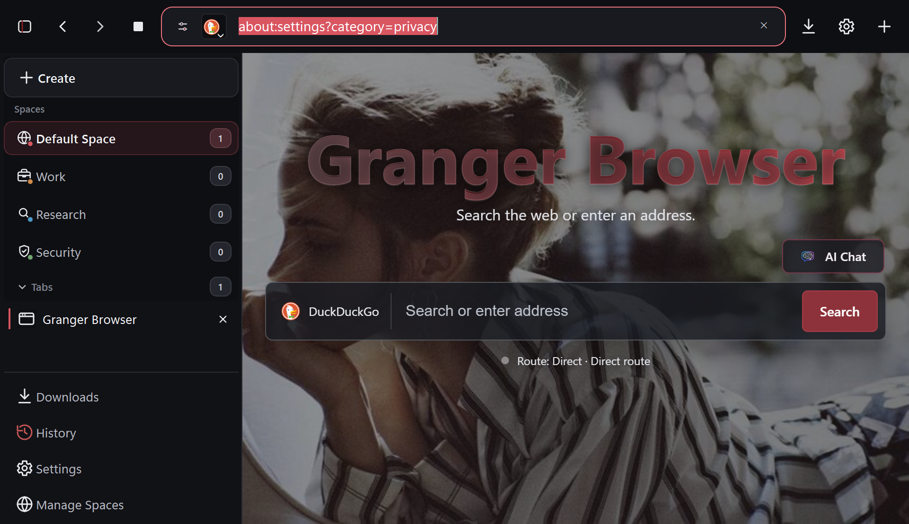

# Granger Browser 0.4.0: release report

Дата проверки: 8 августа 2026 года.

Этот документ фиксирует результат итерации над жизненным циклом Spaces,
Sidebar, интерфейсом Settings -> Spaces, обновлением Qt WebEngine, брендингом,
миграцией пользовательских данных и последующей стабилизацией геометрии
Sidebar/WebEngine. Все проверки Release выполнялись с
изолированными `GRANGER_DATA_ROOT` и `GRANGER_SETTINGS_ROOT`. Реальный
пользовательский профиль исследовался только для определения структуры и не
изменялся.

## 1. Исходный baseline

Предыдущий portable Release зафиксирован до изменений:

| Параметр | Значение |
| --- | --- |
| Qt | 6.9.3 |
| Qt WebEngine | 6.9.3 |
| Chromium base | 130.0.6723.192 |
| `qWebEngineChromiumSecurityPatchVersion()` | 140.0.7339.207 |
| SHA-256 предыдущего EXE | `F4BB6CC2C0C36B8FD84709E30A4F44BFE28DC3190301FEF5453C6941393C39D0` |
| Размер предыдущего EXE | 9 115 136 байт |

Baseline gate прошёл: Product 123/123, New tab 15/15, Feature 77/77,
UI/focus 120/120, Privacy 142/142, Privacy diagnostics 12/12, DevTools 13/13,
Bridges 22/22 и Strategies 8/8.

Сохранённые исходные показатели того же harness: окно 394 мс, стабильный кадр
744 мс, одна вкладка 328.359 MiB working set, десять вкладок 1004.434 MiB,
пять Space-профилей 654.766 MiB.

## 2. Удаление Spaces

### Причина

Старая операция очистки начиналась, когда цепочка владения
`BrowserTab -> QWebEngineView -> QWebEnginePage -> QWebEngineProfile` ещё могла
оставаться живой. Chromium subprocess, service workers, storage handles,
callbacks или download references продолжали держать файлы профиля. На Windows
это превращалось в file lock, а прежняя операция не имела достаточно строгого
постоянного состояния и гарантированного повторного запуска. Поэтому изменение
модели, освобождение профиля и удаление файлов не были одной упорядоченной
транзакцией.

### Новый lifecycle

Реализована явная последовательность:

```text
Active -> Closing -> ProfileRelease -> CleanupPending -> Cleaned
                                                \-> Failed
```

`MainWindow` сначала запрещает новые вкладки Space, закрывает принадлежащие ему
вкладки и отвязывает UI. `ContainerManager` удаляет Space из активной модели
только в рамках begin/commit lifecycle, освобождает все profile references и
продолжает удаление после сигнала `QObject::destroyed`.

Очередь `state/container-cleanup.json` имеет схему v2 и сохраняется атомарно
через `QSaveFile`. `QLockFile` сериализует writers между процессами. Для каждого
живого профиля используется process lease; активные downloads и lease другого
процесса откладывают очистку. Очередь повторяется после освобождения профиля и
при следующем запуске.

Перед удалением проверяются UUID Space, принадлежность известных относительных
путей, canonical root, отсутствие path traversal, symlink/junction escape и
защита Default Space. Повреждённая очередь помещается в quarantine
byte-for-byte; непроверенные пути не удаляются. Ошибка Windows lock сохраняет
запись для следующей попытки, а не маскируется ложным успехом.

Проверки включают пустой Space, 1 и 20 вкладок, активный и неактивный Space,
немедленное создание нового Space, restart manager, межпроцессный lease,
повреждённую очередь, junction escape, Windows lock/retry, отмену
незавершённого удаления при старте и запрет удаления Default Space. Реальные
cookies, localStorage, IndexedDB и CacheStorage подтверждены через loopback HTTP
origin; очистка одного Space не затрагивает другой.

## 3. Sidebar

Причиной визуального дубля было смешение двух разных состояний: активный Space
показывался и как элемент canonical Space selector, и как повторный заголовок
группы вкладок, который одновременно управлял collapse. Повторные rebuild и
state notifications могли расходиться с анимацией и видимостью строк.

Теперь существуют:

- один список Space selector (`m_spaceButtons`);
- один независимый заголовок `Tabs N` (`m_tabsHeaderButton`);
- один `activeSpaceId`;
- одно persisted collapse-состояние на Space;
- одна точка изменения `setTabSectionCollapsed()`.

Предыдущая анимация отменяется перед новой, итоговое состояние выставляется
детерминированно, а reduced-motion завершает переход без декоративного движения.
Stress test покрывает 20 вкладок, быстрые переключения, закрытие вкладок во
время collapse, закрытие последней вкладки и повторное раскрытие. Дубликат
заголовка не появляется.

## 4. Settings -> Spaces

Список Space больше не является постоянно раскрытой административной формой.
Каждая строка показывает локальную иконку, цветовой маркер, название, описание,
число вкладок и site assignments. Действия перенесены в viewport-aware menu:
открыть вкладку, изменить, очистить данные, назначения сайтов и удалить.

Диалог создания/редактирования имеет единые поля, validation, disabled primary
action при пустом имени, focus trap, Escape, click-outside policy и возврат
фокуса. Color picker содержит десять локальных swatches. Icon picker полностью
локальный, поддерживает поиск, grid, keyboard navigation и selected state.

Автотесты подтвердили hover/focus/pressed, закрытие меню по Escape и outside
click, возврат фокуса, flip меню вверх у нижней границы viewport, отсутствие
горизонтального overflow и сохранение модели Space.

Скриншоты проверки:

- `output/release acceptance/path with spaces/feature-captures/04-container-settings.png`;
- `output/release acceptance/path with spaces/feature-captures/04a-container-actions.png`;
- `output/release acceptance/path with spaces/feature-captures/04b-container-dialog.png`;
- `output/release acceptance/path with spaces/feature-captures/04c-color-picker.png`;
- `output/release acceptance/path with spaces/feature-captures/04d-icon-picker.png`;
- `output/granger-final-dpi/dpi-150/captures/06-vertical-tabs-expanded.png`.

## 5. Engine migration

| Параметр | Old | New |
| --- | --- | --- |
| Qt | 6.9.3 | 6.11.1 |
| Qt WebEngine | 6.9.3 | 6.11.1 |
| Chromium base | 130.0.6723.192 | 140.0.7339.225 |
| Security patch API | 140.0.7339.207 | 148.0.7778.96 |

`Security patch API` выше является фактическим значением
`qWebEngineChromiumSecurityPatchVersion()`, сообщённым Qt runtime; версия
Chromium binary отдельно и явно указана как 140.0.7339.225.

Выбрана стабильная Qt 6.11.1, выпущенная 13 мая 2026 года. Следующая patch
версия 6.11.2 на дату проверки ещё не выпущена. Источники:

- https://www.qt.io/blog/qt-6.11.1-released
- https://wiki.qt.io/QtWebEngine/ChromiumVersions
- https://doc.qt.io/qt-6/whatsnew611.html
- https://chromium.googlesource.com/chromium/src/+/refs/tags/140.0.7339.225

Chromium tag соответствует commit
`aa324b3754009b927f7db643b2e837d6a5383b04`. Qt установлен из официального
repository скриптом `scripts/install-qt-6.11.1.ps1`; архивы проверены по
опубликованным SHA-1 до извлечения.

Найдены две реальные несовместимости:

1. Синхронная обработка internal action из
   `BrowserPage::acceptNavigationRequest()` повторно загружала тот же
   `QWebEnginePage` внутри Chromium navigation callback. В Chromium 140 это
   приводило к 0x80000003. Dispatch переведён в queued invocation.
2. Storage fixtures на `setHtml()` больше не являлись надёжным доказательством
   first-party storage. Feature и UI tests используют настоящий loopback HTTP
   origin для cookies, localStorage, IndexedDB и CacheStorage.

Privacy, cookie и network policies ради совместимости не ослаблялись.

## 6. Branding Granger Browser

Единый владелец идентичности находится в `granger/core/Brand.*`. Обновлены
target, `GrangerBrowser.exe`, namespace `granger`, window/taskbar title, Windows
VersionInfo, `.rc`, Qt resources, internal URLs, About, settings filename,
credential target, translations ru/en/kk, environment variables, scripts,
README, BUILDING, SECURITY и portable directory.

Текущий data root:

```text
%LOCALAPPDATA%\Granger\Granger Browser\
```

Audit активных исходников нашёл 35 строк прежней идентичности, и все они
классифицированы как migration/backward compatibility:

- `granger/core/AppPaths.cpp`: 4 fallback environment aliases;
- `granger/core/Brand.cpp`: 21 legacy constants и environment aliases;
- `granger/core/BrandMigration.cpp`: 6 legacy settings/environment mappings;
- `granger/main.cpp`: 2 settings-root aliases;
- `granger/settings/SettingsManager.cpp`: 2 settings-root aliases.

В UI, metadata, target names, новых settings keys, resources, translations,
tests и актуальной документации прежняя идентичность не используется. Raw
binary scan видит 21 uppercase compatibility alias, потому что они нужны для
однократной миграции и старых test overrides; package acceptance отдельно
подтвердил 0 legacy-named entries и 0 user-visible text matches. Исторические
отчёты сохранены как evidence и не входят в runtime package.

Внешнее имя каталога, в котором размещён рабочий checkout, не является частью
продукта и намеренно не менялось автоматически.

## 7. Миграция пользовательских данных

`BrandMigration` выполняет однократный перенос из legacy application-data root
в `%LOCALAPPDATA%\Granger\Granger Browser`. Переносятся persistent settings,
Spaces, cookies, sessions, bookmarks, history, download history, site rules,
Pamp data и Tor configuration.

Алгоритм:

1. Отказ, если legacy executable ещё запущен.
2. Проверка непересекающихся roots и запрет reparse-point escape.
3. Копирование в staging без cache, lock, singleton и temporary files.
4. SHA-256 verification каждого файла.
5. Атомарная запись versioned marker через `QSaveFile`.
6. Атомарный rename staging в destination.
7. Legacy source остаётся rollback-копией; replay guard не позволяет повторно
   применить старые данные.

Непустой новый профиль никогда не перезаписывается. Ошибка до commit удаляет
только staging и оставляет оба persistent roots пригодными для восстановления.
Migration suite 12/12 проверяет byte-for-byte данные, idempotency, существующий
destination, unsafe link abort, rollback и replay guard. Тест выполнен на
fixture-копии, не на production profile.

## 8. Regression и performance

Финальный gate:

| Suite | Результат |
| --- | --- |
| Product | 123/123 |
| New tab | 15/15 |
| Feature / Spaces / downloads | 110/110 |
| UI/focus | 120/120 |
| Privacy | 142/142 |
| Privacy diagnostics | 12/12 |
| DevTools | 13/13 |
| Bridges | 22/22 |
| Connection strategies | 8/8 |
| Branding | 15/15 |
| Brand migration | 12/12 |

Bridge tests включают обе обязательные IPv4 obfs4 строки, exact Bridge-line
preservation, WebTunnel, Snowflake, vanilla, future transport, IPv6 и ошибки
валидации. Tor 0.4.9.11 проверил сгенерированные configs; lyrebird 0.8.1 реально
запущен в obfs4 strategy smoke до bootstrap 1%. UI не показывал fake Connected.

Content blocker, URL cleaner, HTTPS-First, TLS rejection, WebRTC policy,
fingerprint profiles, Onion isolation, Pamp Lite, downloads, session restore и
DevTools прошли существующие suites без изменения сетевой архитектуры.

Performance одного и того же harness:

| Метрика | Baseline | Final | Изменение |
| --- | ---: | ---: | ---: |
| Window shown | 394 ms | 491 ms | +24.6% |
| Stable frame | 744 ms | 842 ms | +13.2% |
| 1 tab working set | 328.359 MiB | 381.910 MiB | +16.3% |
| 10 tabs working set | 1004.434 MiB | 1114.629 MiB | +11.0% |
| 5 Space profiles working set | 654.766 MiB | 716.504 MiB | +9.4% |
| Space activation average | 9703.676 us | 12577.248 us | +29.6% |
| Settings open | 11908.9 us | 14698.4 us | +23.4% |
| 100 Settings switches average | 15870.044 us | 17133.879 us | +8.0% |
| 50 navigation transitions average | 26306.978 us | 27308.570 us | +3.8% |
| 10 tab cycles average | 46.0 ms | 50.8 ms | +10.4% |
| Pamp report open | 124 ms | 155 ms | +25.0% |

Регрессии не скрываются. Их совпадение с переходом на новое поколение
Qt/Chromium позволяет предположить существенную engine cost, но тест не
доказывает единственную причинность. Короткая idle CPU sample изменилась с
10.03% до 3.71% машины с 12 logical CPUs; двухсекундное измерение слишком
шумное для заявления об улучшении.

DPI 100%, 125%, 150%, 175% и 200%: по 120/120 UI/focus cases и по 31 capture,
без paint/assert/crash/layout-loop warnings. Проверены normal, maximized,
fullscreen, collapsed/expanded Sidebar, ru/en/kk, narrow Settings, popup у края
viewport и reduced-motion behavior.

Live search checks: DuckDuckGo, Bing, Brave, Startpage, Yandex и Onion прошли.
Google вернул внешний anti-bot challenge, Mojeek — внешний HTTP 403; эти ответы
не маскируются как успех приложения.

## 9. Portable Release

Канонический артефакт:

```text
release\Granger Browser\GrangerBrowser.exe
```

| Параметр | Значение |
| --- | --- |
| Version | 0.4.0 |
| Size | 9 456 128 bytes |
| SHA-256 | `2863CFCE9E8E5EDCB0EBA538CE0F475A3D96188BE6166A9F6C7A8F5D2991ACBD` |
| ProductName | Granger Browser |
| FileDescription | Granger Browser privacy browser |
| OriginalFilename | GrangerBrowser.exe |
| InternalName | GrangerBrowser |
| Qt / Qt WebEngine | 6.11.1 / 6.11.1 |
| Chromium | 140.0.7339.225 |

Acceptance запускал копию package из пути с пробелами, с unrelated working
directory, без Python в `PATH` и без IDE. После gate: paint warnings 0, orphan
processes 0, legacy-named package entries 0, user-visible legacy text matches 0.
Release содержит одну каноническую директорию `Granger Browser`; staging и
previous directories отсутствуют.

Основные screenshot evidence:

- Home/collapsed: `output/granger-final-dpi/dpi-100/captures/01-normal.png`;
- Sidebar expanded: `output/granger-final-dpi/dpi-150/captures/06-vertical-tabs-expanded.png`;
- Download active/complete: `output/release acceptance/path with spaces/download-active.png` и `download-completed.png`;
- Tor settings: `output/granger-final-screens/tor-settings.png`;
- About: `output/granger-final-screens/about.png`;
- DPI matrix: `output/granger-final-dpi/dpi-{100,125,150,175,200}/captures/`.

## 10. Изменённые файлы и ограничения

Основные владельцы изменений:

- build/release: `CMakeLists.txt`, `scripts/build-release.ps1`,
  `scripts/compile-release.ps1`, `scripts/package-release.ps1`,
  `scripts/test-release.ps1`, `scripts/install-qt-6.11.1.ps1`;
- brand/migration: `granger/main.cpp`, `granger/core/Brand.*`,
  `granger/core/BrandMigration.*`, `granger/core/BrandSmokeTests.*`,
  `granger/core/BrandMigrationSmokeTests.*`, `granger/core/AppPaths.*`,
  `granger/settings/SettingsManager.*`;
- Space lifecycle/UI: `granger/containers/ContainerManager.*`,
  `granger/tabs/TabManager.*`, `granger/ui/MainWindow.*`,
  `granger/ui/ContainerEditorDialog.*`, `granger/browser/InternalPages.*`;
- engine compatibility/tests: `granger/browser/BrowserPage.cpp`,
  `granger/features/FeatureSmokeTests.cpp`,
  `granger/ui/UiFocusSmokeTests.cpp`;
- resources/localization: `granger/resources/GrangerBrowser.rc`,
  `granger/resources/resources.qrc`, `granger/resources/translations/*.json`,
  `locales/*.json`;
- documentation: `README.md`, `BUILDING.md`, `SECURITY.md`, `NOTICE.txt`,
  `docs/SPACES_DOWNLOAD_REFERENCES.md` и этот отчёт.

Честные ограничения финальной проверки:

- production migration не запускалась; проверена fixture-копия и отдельный
  test-profile;
- полноценная перезагрузка Windows не выполнялась; clean process launch,
  copied package, path with spaces и unrelated cwd использованы как близкий
  reboot-style сценарий;
- живой внешний Tor route в финальном screenshot не поднимался: изолированный
  профиль честно показывает Direct / Not configured; config, strategy, bridge
  parser, torrc verification и начало obfs4 bootstrap проверены отдельно;
- Google anti-bot challenge и Mojeek 403 являются внешними ограничениями;
- Qt proxy остаётся process-wide ограничением Qt WebEngine;
- EXE не подписан цифровой подписью;
- memory для 50 одновременно открытых вкладок не измерялась: измерены 10
  вкладок и 50 navigation/switch transitions;
- active-download workflow прошёл функционально, но отдельного before/after
  CPU/memory benchmark для него нет;
- DPI screenshots являются детерминированными test captures и не охватывают
  каждую физическую комбинацию monitor/GPU/driver;
- idle CPU измерялся только две секунды;
- legacy source сохраняется после успешной миграции как rollback copy и не
  удаляется автоматически.

## 11. GitHub import и стабилизация Sidebar

### Репозиторий и границы этапа

Текущее каноническое дерево опубликовано в приватном репозитории
`https://github.com/zakhar-git/Granger-Browser.git`. Чистый исходный baseline
зафиксирован в `main` коммитом `a011760`; работа выполнена в ветке
`agent/sidebar-layout-stability`. В репозиторий не включены `build/`, `output/`,
`release/`, Qt deployment, EXE/DLL/PDB, browser profiles, cookies, history,
LocalStorage, session state, Tor runtime data, логи и crash dumps. Gitleaks 8.30.1
не обнаружил секретов в публикуемом дереве; три совпадения в комментариях
EasyList зафиксированы точными allowlist-правилами как проверенные false positive.

Этап не обновляет Qt, Qt WebEngine, Chromium, Tor или lyrebird и не меняет
SOCKS/DNS routing, bridges, HTTPS/TLS, blocker, container isolation либо privacy
profiles. Release по-прежнему использует Qt/Qt WebEngine 6.11.1 и Chromium
140.0.7339.225.

### Причины и исправления

**BottomNavigation.** Нижние действия находились в том же вертикальном layout,
что и изменяющие высоту Spaces/Tabs. При скрытии `TabScrollArea` Qt заново
распределял свободную высоту между соседями, поэтому системные строки визуально
поднимались или растягивались. Sidebar разделён на расширяемый `SidebarTopArea`
и фиксированный по вертикальной политике `BottomNavigation`. Нижний блок является
непрокручиваемым sibling верхней области; collapse меняет только область вкладок,
без absolute positioning, `move()`, таймеров и магических координат.

**Rapid toggle.** Одного `m_expanded` было недостаточно для прерванной анимации:
видимая ширина Sidebar и зарезервированная ширина content могли двигаться к
разным целям, а зависимый Download UI обновлялся по номинальному timer delay.
Повторный toggle останавливал текущий ход, но не имел единого владельца
терминального состояния и сигнала фактического завершения геометрии.

Теперь `SidebarTransitionState` явно различает `Closed`, `Opening`, `Open` и
`Closing`. Один постоянный `QVariantAnimation` продолжает движение от текущих
ширин, а длительность пропорциональна оставшемуся пути. Единственный
`applySidebarGeometry()` одновременно задаёт ширину Sidebar и reserved space;
один `finishSidebarTransition()` фиксирует конечные значения и отправляет
`sidebarGeometrySettled`. Hover хранится явно и сбрасывается при hide/fullscreen.
Download UI реагирует на реальное завершение, а не на отложенный таймер.

**QWebEngineView viewport.** После изменения внешнего spacer вложенный layout и
фиксированный privacy-letterbox viewport не всегда синхронно активировались для
скрытой или только что выбранной вкладки. Chromium surface мог до следующего
resize сохранять прежнюю ширину. `BrowserTab::synchronizeViewportGeometry()`
останавливает отложенный letterbox update, применяет существующий privacy bucket,
активирует layout и обновляет geometry. Метод вызывается после settle Sidebar,
show и смены вкладки. Это не JavaScript resize и не CSS zoom. Диагностика хранит
только прямоугольники и DPR, без URL: при 125% DPI раскрытое состояние имеет
Sidebar/reserved `288/288` и viewport `1248x737`; компактное - `64/64` и
`1472x737`, в обоих случаях `matchesExpected=true`.

**Lowercase `g`.** Текст с прозрачной gradient-заливкой рисовался в строковом
box с `line-height: 1.04` без нижнего paint space. Descender буквы `g` попадал за
clip границу inline box. Заголовок получил `overflow: visible`, `line-height:
1.08`, нижний padding `.16em` и компенсирующий margin. Размер и положение glyph
не меняются по фазам анимации; исправление относится ко всей типографике, а не к
отдельной букве.

**UI polish.** Spaces и Tabs получили отдельные заголовки и компактные count
badges; active Space/tab и текущая системная страница используют сдержанный
фон/маркер; BottomNavigation отделена тонким separator и имеет одинаковые строки,
иконки и интервалы. Существующие favicon, drag-and-drop и `AnimationPolicy`
сохранены.

### Коммиты и файлы

| Commit | Назначение |
| --- | --- |
| `73ab58b` | закрепить независимую BottomNavigation |
| `6c31399` | добавить обратимую state machine геометрии Sidebar |
| `57185d4` | синхронизировать реальный WebEngine viewport |
| `7fccc45` | устранить clipping descender заголовка |
| `5b3daae` | улучшить визуальную иерархию Spaces/Tabs |
| `01204bd` | добавить geometry, stress, DPI и idle regression coverage |
| `ef4c15c` | убрать race загрузки локализованного Settings dropdown в smoke |

Изменены только `granger/tabs/TabManager.*`, `granger/browser/BrowserTab.*`,
`granger/browser/InternalPages.cpp`, `granger/ui/MainWindow.cpp`,
`granger/ui/ThemeManager.cpp`, `granger/main.cpp`,
`granger/features/FeatureSmokeTests.cpp` и `granger/ui/UiFocusSmokeTests.cpp`,
а также документация и приведённые ниже test-capture.

### Проверки

- clean Qt 6.11.1 Release compile: успешно;
- Feature smoke: 115/115;
- UI/focus smoke: 124/124 два раза на независимых профилях;
- Product: 123/123; Privacy: 142/142; Strategies: 8/8;
- Bridges: 22/22; QR: 5/5; New tab: 15/15;
- 20 reversals во время resize/tab switch и 50 немедленных toggles: успешно;
- 15 tab switch/close без stale WebEngine objects: успешно;
- idle 4 s: `LayoutRequest=0`, animation lifecycle events `=0`;
- full packaged acceptance из unrelated working directory и пути с пробелами:
  успешно за 232.2 s, paint warnings `0`, orphan processes `0`;
- DPI 100%, 125%, 150%, 175%, 200%: в каждом прогоне 124/124, без overlap,
  horizontal overflow, обрезания заголовка или popup за viewport;
- Downloads, container DnD, bridge exact preservation, Tor config/strategy,
  privacy, blocker и DevTools прошли существующие regression suites.

### Screenshot evidence

Раскрытый Sidebar при 100% DPI:



Компактный Sidebar с полностью видимым `g`:



Проверки 150% и 200% DPI:





Ограничения: pixel evidence получен детерминированным Qt smoke harness на текущем
Windows/GPU/driver; он не заменяет матрицу всех физических мониторов. Внешние
поисковые ответы зависят от exit/network policy (Google anti-bot и Mojeek 403 уже
задокументированы выше). EXE остаётся без цифровой подписи. Pull Request должен
быть просмотрен и объединён владельцем вручную.
