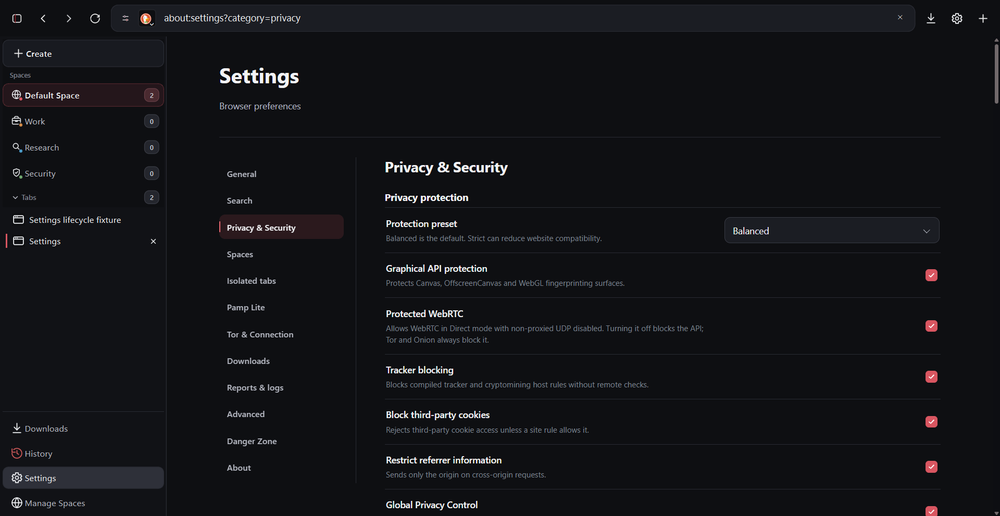
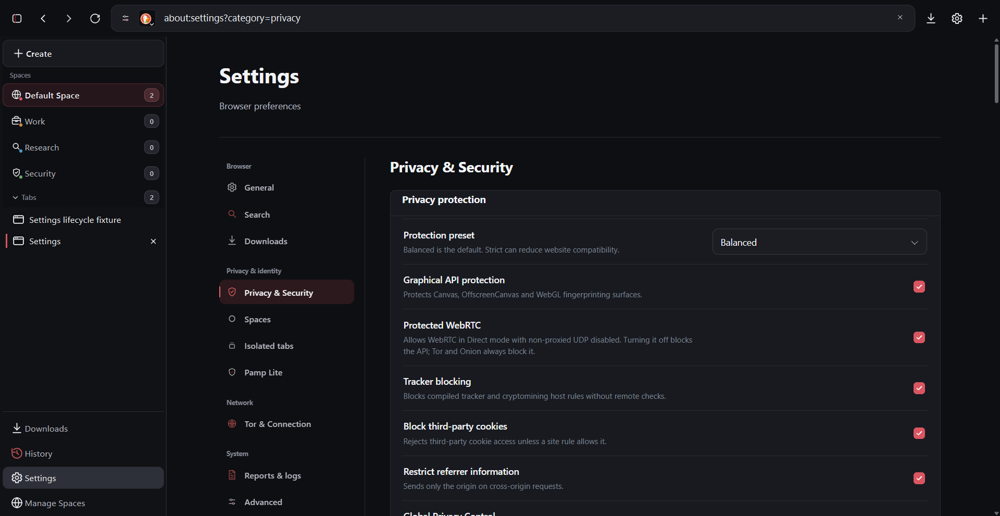

# Отчёт по UI/UX-модернизации Granger Browser

Дата приёмки: 2026-08-10
Область работ: presentation layer существующего Qt Widgets/Qt WebEngine приложения
Итог: packaged Release собран, запущен и прошёл полный автоматизированный и визуальный acceptance

Этот этап не создаёт новый браузер, новый UI framework или параллельную модель данных.
Изменения выполнены в существующих владельцах интерфейса. Tor, сетевой маршрут,
профили, privacy defaults и физический Tor-letterboxing сохранены.

## 1. Git/GitHub

| Параметр | Значение |
| --- | --- |
| Repository | `https://github.com/zakhar-git/Granger-Browser.git` |
| Ветка | `main` |
| Remote | `origin/main` |
| Pull Request этой итерации | не создавался |
| Синхронизация | local `main` = `origin/main` (`0 0`) |
| Force push | не выполнялся |
| Merge | не выполнялся |

Каждый законченный этап оформлен отдельным commit и сразу отправлен в `origin`:

| Commit | Этап |
| --- | --- |
| `92bf3a6` | `ui(theme): establish unified design tokens` |
| `7657abb` | `ui(scrollbars): add minimal local interaction policy` |
| `7411709` | `ui(settings): group navigation and preference surfaces` |
| `a78a39a` | `ui(downloads): redesign native download surfaces` |
| `c6c3a4a` | `ui(sidebar): refine Spaces and tab presentation` |
| `cb8283f` | `ui(internal): refine history and Space Manager` |
| `0595605` | `ui(toolbar): refine browser chrome interaction states` |
| `af21f08` | `ui(internal): unify card styling across internal pages` |
| `e8ca40c` | `test(ui): add visual geometry regression coverage` |
| `4b3251d` | `docs(ui): document visual evolution acceptance` |
| `876bbee` | `fix(release): enforce canonical promotion workflow` |
| `e56aca7` | `ui(settings): normalize settings card geometry` |
| `2b68ad6` | `ui(settings): embed owner navigation icons` |
| `812cc53` | `ui(spaces): add compact Space switcher` |
| `24cf9fa` | `perf(navigation): reduce local search dispatch overhead` |

Архитектурный аудит находится в
[`UI_UX_ARCHITECTURE_AUDIT.md`](UI_UX_ARCHITECTURE_AUDIT.md). Источники
визуальных и accessibility-паттернов и их лицензии описаны в
[`UI_DESIGN_REFERENCES.md`](UI_DESIGN_REFERENCES.md).

## 2. Design system

### Владельцы

- `granger/ui/DesignTokens.h` хранит цвета, размеры, spacing, radii, тени и motion.
- `granger/ui/ThemeManager.cpp` применяет токены к Qt palette/QSS.
- `granger/ui/AnimationPolicy.*` остаётся единственным владельцем настройки
  reduced motion и продолжительности анимаций.
- `granger/browser/InternalPages.cpp` получает те же значения через локальную
  token substitution для встроенных HTML/CSS/JavaScript страниц.
- `ScrollBarController`, `DownloadUi`, `TabManager`, `NavigationBar` и
  `MainWindow` расширяют существующие Qt-компоненты, не создавая параллельных
  backend или моделей.

### Палитра

| Token | Значение |
| --- | --- |
| window / toolbar / sidebar | `#0e0f12` / `#141519` / `#111216` |
| surface / elevated / control | `#181a20` / `#202229` / `#1b1d23` |
| hover / active | `#262831` / `#2e3039` |
| text primary / secondary / muted / disabled | `#f2f3f5` / `#b5b8c2` / `#7e838f` / `#646873` |
| border subtle / default / strong | `#292b33` / `#383a44` / `#4d505b` |
| focus / accent / accent hover | `#ed747d` / `#d95661` / `#e96872` |
| success / warning / error / info | `#50ba8a` / `#e0ab55` / `#e45d68` / `#68a7d8` |

### Размеры и типографика

| Группа | Значения |
| --- | --- |
| Spacing | `4, 8, 12, 16, 20, 24, 32 px` |
| Radii | `6, 9, 12, 14 px` |
| Controls | `32, 40, 44 px` |
| Typography | caption `11`, body/control `13`, section `18`, page title `32 px` |
| Font stack | локальные `Segoe UI Variable`, `Segoe UI`, system sans-serif |
| Toolbar | `56 px`, кнопка `36 px`, address bar `42 px` |
| Sidebar | compact `64 px`, expanded `256 px` |
| Tab row | `46 px` |

### Motion

| Состояние | Длительность |
| --- | --- |
| hover / pressed / focus | `110 / 80 / 120 ms` |
| popup / dialog | `150 / 170 ms` |
| tab / reorder | `180 / 190 ms` |
| Space switch / Sidebar | `220 / 210 ms` |
| Download UI / scrollbar fade | `210 / 140 ms` |
| DevTools / fullscreen | `200 / 175 ms` |

Анимации ограничены opacity, цветом, рамкой, тенью и небольшим перемещением.
Новые постоянные timers, большие blur-области, glassmorphism и layout-анимации
не добавлены.

### Источники и лицензии

Изучались shadcn/ui (MIT), Radix Primitives (MIT), HyperUI (MIT) и Flowbite
(MIT для open-source кода; документация CC BY 3.0). Проверялись принципы
иерархии, focus management, keyboard navigation, popup collision и form
grouping. Код, пакеты, иконки, шрифты, artwork и branding этих проектов не
копировались. Реализация выполнена самостоятельно на Qt Widgets и локальном
HTML/CSS/JavaScript, поэтому обязательного attribution за перенесённый код нет;
сведения о reference всё равно включены в проект и packaged `licenses`.

## 3. Scrollbars

### Qt Widgets

`granger/ui/ScrollBarController.*` устанавливает единый event filter на
существующие `QScrollBar`. Контроллер:

- показывает scrollbar при wheel, hover, press, drag, range/value change;
- удерживает его видимым во время прямого взаимодействия;
- через `850 ms` idle переводит opacity к `0.22`;
- использует общий `AnimationPolicy`; при reduced motion меняет состояние без
  декоративного fade;
- не создаёт timer на каждый scrollbar: используется один периодический
  контроллер для зарегистрированных полос;
- скрывает Windows arrows и тяжёлый track через общий QSS.

Qt target имеет ширину `8 px` и inset `2 px`, то есть видимый thumb около
`4 px`. Hover и active получают отдельные контрастные цвета.

### Internal HTML

Локальный CSS/JavaScript применяет ту же ширину, inset, цвета и idle policy
только к встроенным `about:` страницам. Код не загружает внешние ресурсы и не
подменяет scrolling engine. Проверены Settings, History, Downloads, Space
Manager и длинные internal pages.

Scrollbar внешних сайтов намеренно не стилизуется: страница управляется
QWebEngine/Chromium и её собственным CSS. Это сохраняет границу между browser
chrome и чужим web content.

Скриншот: [Settings scrollbar](screenshots/ui-ux-evolution/stage-02/07l-settings-scrollbar.png).

## 4. Settings

### До

Settings выглядел как длинный технический список: слабая группировка,
неодинаковая плотность, тяжёлые поверхности и визуально разрозненные controls.

### После

- Категории объединены в смысловые группы с компактной левой навигацией.
- Related preferences собраны в умеренно плотные card/section surfaces без
  вложенных card-in-card.
- Поля, кнопки, checkbox и action rows используют общую высоту, border, radius,
  focus ring и disabled state.
- Custom select сохраняет скрытый native `select` как источник значения, но
  рисует локальный listbox с collision handling, открытием вверх при нехватке
  места, typeahead, `Enter`, `Space`, `Escape`, arrows, `Home` и `End`.
- При закрытии listbox focus возвращается trigger.
- Импорт/экспорт, bridge status updates и language switching не перестраивают
  активную категорию и не меняют backend значений.
- На узких viewport навигация становится компактной responsive-сеткой без
  horizontal overflow.
- Новые строки добавлены в `ru`, `en` и `kk`; branding не переводится.

Дополнительные captures:

- [English](screenshots/ui-ux-evolution/stage-03/07c-settings-general-en.png)
- [Русский](screenshots/ui-ux-evolution/stage-03/07d-settings-general-ru.png)
- [Қазақша](screenshots/ui-ux-evolution/stage-03/07e-settings-general-kk.png)
- [Открытый custom select](screenshots/ui-ux-evolution/stage-03/07i-settings-dropdown-open.png)
- [Import/export](screenshots/ui-ux-evolution/stage-03/07k-settings-import-export.png)
- [Узкая казахская навигация](screenshots/ui-ux-evolution/stage-03/07o-settings-narrow-navigation-kk.png)

Settings backend, значения, privacy defaults и маршрутизация не менялись.

## 5. Download Panel

`DownloadUi` продолжает отображать существующие immutable download snapshots и
вызывать существующие pause/resume/cancel/retry/open/reveal actions. Новый
downloader, сетевой клиент или security path не создан.

Изменения presentation layer:

- floating panel с ограниченными `420 px` шириной и `560 px` высотой;
- компактные download cards с именем, источником, состоянием и actions;
- determinate и unknown-length progress states;
- отдельные визуальные состояния active, paused, completed, cancelled, failed
  и retry;
- security/error message остаётся видимым, а не маскируется success-состоянием;
- download shelf уменьшен и использует те же токены и действия;
- popup clamped к доступному экрану и не выходит за viewport.

Скриншоты:

- [До](screenshots/ui-ux-evolution/stage-04/01-download-panel-before.png)
- [Активная загрузка](screenshots/ui-ux-evolution/stage-04/02-download-active-panel-after.png)
- [Завершённая](screenshots/ui-ux-evolution/stage-04/03-download-completed-panel-after.png)
- [Ошибка и retry](screenshots/ui-ux-evolution/stage-04/04-download-failure-retry-after.png)
- [Download shelf](screenshots/ui-ux-evolution/stage-04/05-download-shelf-browser-after.png)

## 6. Sidebar

- Expanded Sidebar уменьшен до `256 px`, compact rail сохранён на `64 px`.
- Постоянный список Spaces заменён одной строкой высотой `36 px`: previous,
  активный Space с локальной icon/marker/count и next.
- Click, vertical/horizontal wheel и `Left`/`Right`/`Up`/`Down` переключают
  Space циклически; `Home`/`End` выбирают границы списка.
- `Enter`/`Space` открывают единый all-Spaces popup из существующей модели;
  popup ограничен `320 x 520 px`, остаётся внутри экрана и поддерживает
  keyboard navigation, `Escape` и drag-and-drop tab в выбранный Space.
- При `1`, `4`, `10` и `25` Spaces строка остаётся `36 px` и не вытесняет
  tabs/BottomNavigation; длинное имя визуально elide, но полностью доступно
  через accessible name и tooltip.
- Tabs используют стабильную высоту `46 px`, отдельные favicon/title/close
  области, спокойный active state и ненавязчивые container/isolated indicators.
- Collapsed mode центрирует favicon, скрывает текст без накопления geometry
  offset и оставляет нормальную click area/tooltip.
- BottomNavigation закреплена в существующей layout-модели и не прыгает при
  переключении Space, количестве tabs или Sidebar mode.
- Добавлена локальная overflow icon; remote icon set не подключался.

Скриншоты:

- [Expanded до](screenshots/ui-ux-evolution/stage-05/01-sidebar-expanded-before.png)
- [Expanded после](screenshots/ui-ux-evolution/stage-05/04-sidebar-expanded-after.png)
- [Плотный список tabs](screenshots/ui-ux-evolution/stage-05/05-sidebar-dense-tabs-after.png)
- [Compact после](screenshots/ui-ux-evolution/stage-05/06-sidebar-collapsed-after.png)
- [Compact + reduced motion](screenshots/ui-ux-evolution/stage-05/07-sidebar-collapsed-reduced-motion.png)
- [Letterbox + expanded Sidebar](screenshots/ui-ux-evolution/stage-05/08-letterbox-expanded-after.png)

Geometry regression проверяет hidden, compact и expanded режимы, 50 быстрых
переключений, `25` Spaces и отсутствие накопленного horizontal offset.

## 7. Главная страница и browser chrome

Главная страница не заменена новой landing page. Сохранены существующие:

- локальные wallpaper/resources;
- анимированный чёрно-красный заголовок Granger Browser;
- search composition и route indicator;
- responsive ограничения контента;
- reduced-motion поведение заголовка и индикатора.

UI-этап не менял SearchEngineManager, URL parsing или сетевой маршрут. Главная
страница лишь получила согласованные surface/border/spacing tokens и корректно
остаётся внутри защищённого viewport.

Toolbar и address bar приведены к общей системе: кнопки `36 px`, address bar
`42 px`, одинаковые gaps, focus/pressed/disabled states, локальная overflow
icon и viewport-clamped provider/site/context popups. Реальный URL и security
state не скрываются и не подменяются.

Скриншоты:

- [Toolbar до](screenshots/ui-ux-evolution/stage-07/01-toolbar-before.png)
- [Toolbar после](screenshots/ui-ux-evolution/stage-07/02-toolbar-after.png)
- [Provider menu после](screenshots/ui-ux-evolution/stage-07/04-provider-menu-after.png)
- [Site Information](screenshots/ui-ux-evolution/stage-07/05-site-info-after.png)
- [Context menu](screenshots/ui-ux-evolution/stage-07/06-context-menu-after.png)

## 8. Internal pages

Общий local stylesheet вводит `.ds-card`, `.ds-section`, `.ds-selectable-row`,
единые action bars, status tones, controls и responsive правила. Автотест
запрещает nested `.ds-card .ds-card` и проверяет nonzero border/radius/surface.

- History сгруппирована по датам и использует компактные selectable rows.
- Space Manager показывает icon, marker, name, description, tab/rule counts,
  persistence и отдельное actions menu; destructive actions визуально отделены.
- Reports и Pamp Lite используют одинаковую иерархию summary/metric/detail,
  сохраняя существующий Pamp backend.
- Privacy, Bridges, Bookmarks и Reports приведены к общей card language.
- About, Dangerous zone, diagnostics, cookies и permission surfaces получают
  те же palette, typography, controls и scrollbar policy.

Скриншоты:

- [Space Manager до](screenshots/ui-ux-evolution/stage-06/01-space-manager-before.png)
- [Space Manager после](screenshots/ui-ux-evolution/stage-06/02-space-manager-after.png)
- [Space actions](screenshots/ui-ux-evolution/stage-06/03-space-actions-after.png)
- [History](screenshots/ui-ux-evolution/stage-06/04-history-after.png)
- [Reports до/после](screenshots/ui-ux-evolution/stage-08/01-reports-before.png) / [после](screenshots/ui-ux-evolution/stage-08/02-reports-after.png)
- [Pamp network до/после](screenshots/ui-ux-evolution/stage-08/03-pamp-network-before.png) / [после](screenshots/ui-ux-evolution/stage-08/04-pamp-network-after.png)
- [Privacy cards](screenshots/ui-ux-evolution/stage-09/01-internal-privacy-wide.png)
- [Bridges cards](screenshots/ui-ux-evolution/stage-09/02-internal-bridges-wide.png)
- [Bookmarks cards](screenshots/ui-ux-evolution/stage-09/03-internal-bookmarks-wide.png)
- [Bridges narrow](screenshots/ui-ux-evolution/stage-09/04-internal-bridges-narrow.png)

## 9. Accessibility

Проверено:

- keyboard focus остаётся видимым для Qt и internal controls;
- `Tab`/`Shift+Tab`, `Enter`, `Space`, `Escape`, arrows, `Home`, `End` и
  typeahead работают в custom select/menu сценариях;
- popup закрывается по `Escape` и outside click, focus возвращается trigger;
- listbox использует `role=option`, `aria-selected`, `aria-disabled` и
  `aria-expanded`;
- labels и descriptions не заменены декоративными placeholders;
- status не передаётся только цветом;
- reduced motion отключает decorative transitions без изменения layout;
- русские, английские и казахские строки не смешиваются в проверенных экранах;
- при 100-200% DPI controls не выходят за viewport и текст не клипается.

UI/focus suite вырос с `138` до `170` passing cases. Это focused engineering
проверка, а не сертифицированный внешний screen-reader audit; такое ограничение
зафиксировано честно.

## 10. Performance

Первый dedicated performance baseline был записан после раннего UI-этапа
(stage 03), а не на чистой базовой ветке. Поэтому таблица показывает стабильность
итерации, но не выдаётся за лабораторное сравнение base branch.

| Метрика | Stage 03 | Финал |
| --- | ---: | ---: |
| Main window construction | `109 ms` | `111 ms` |
| Total smoke | `6406 ms` | `6143 ms` |
| Settings open call | `16.740 ms` | `21.574 ms` |
| Settings switch average | `19.625 ms` | `18.969 ms` |
| Navigation stress average | `29.680 ms` | `28.461 ms` |
| Search popup open | `6.336 ms` | `8.100 ms` |
| Tab cycle average | `57.8 ms` | `54.1 ms` |
| Profile creations | `2` | `2` |
| Navigation layout failures | `0` | `0` |

Single-run microtimings зависят от планировщика Windows и не интерпретируются как
benchmark-grade проценты. Все финальные значения находятся внутри project gates.

Дополнительный packaged container smoke:

- окно создано за `138 ms`, показано за `489 ms`, stable frame за `839 ms`;
- idle CPU: `1.63%` от машины за 2-second sample;
- one-tab working set: `332.88 MiB` с учётом descendant WebEngine processes;
- пять containers готовы за `920 ms`, средняя activation `14.935 ms`;
- Pamp Lite fixture открылся за `154 ms`;
- isolated profile count после закрытия вернулся к `0`.

### Navigation/Tor audit 2026-08-10

Focused benchmark использует только фиксированные `.invalid` fixtures, не
записывает пользовательские URL и не выполняет сеть. Семь одинаковых запусков
до и после изменения дали такие median значения:

| Локальная стадия | До | После |
| --- | ---: | ---: |
| Input resolution | `82.614 us` | `1.690 us` |
| Search URL builder | `3.219 us` | `2.888 us` |
| Settings lookup | `0.638 us` | `0.651 us` |
| Enter -> WebEngine `loadStarted` | `6.882 ms` | `7.067 ms` |

Причина локального overhead была в создании одинаковых `QRegularExpression` и
split/join на каждый Enter. Regex теперь process-local immutable, whitespace
нормализуется одним `QString::simplified()`, каталог поисковиков создаётся один
раз, internal action URL не парсится для обычного ввода, а выбранный provider
читается только для search-навигации. URL encoding, HTTPS-First и privacy gates
не менялись.

Полный Enter -> `loadStarted` не стал статистически быстрее: несколько
микросекунд resolver теряются внутри scheduler/WebEngine variance. Это честное
ограничение, а не обещание ускорить Tor до direct connection.

Финальный performance smoke больше не зависит от сетевого `loadStarted` для
завершения. Он синхронно измеряет `openAddressForDiagnostics()`, подтверждает
переданный в `BrowserTab::lastRequestedUrl()` provider и полностью декодированное
значение query, а `loadStarted` сохраняет только как необязательную телеметрию.
После намеренно неудачного WebTunnel apply тест восстанавливает исходный режим
подключения, поэтому no-direct-fallback не обходится и test profile не остаётся
изменённым. Семь последовательных запусков с чистыми профилями завершились
успешно (`7/7`), median synchronous dispatch составил `10.972 ms`, median полного
smoke run — `7.005 s`; прежний 30-second network-dependent timeout не повторился.

Сетевой контроль на одном и том же `check.torproject.org/api/ip`, пять запусков
на каждую route:

| Route | Min | Median | Average | Max |
| --- | ---: | ---: | ---: | ---: |
| Direct observation | `447 ms` | `490 ms` | `525.8 ms` | `659 ms` |
| Уже поднятый Tor route | `881 ms` | `942 ms` | `994.2 ms` | `1174 ms` |

Отдельный clean automatic run поднял bundled Tor и достиг browser-verified
route за `75.165 s`; статус был принят только после `100%` bootstrap и реального
Tor-check (`IsTor=true`). Следовательно, заметная задержка принадлежит startup и
внешнему Tor/network path, тогда как собственный synchronous dispatch Granger
остаётся около нескольких миллисекунд.

Request interceptor измерен на тех же фиксированных fixtures (десятки/сотни
микросекунд на decision в зависимости от нагрузки) и не изменялся. Не отключены
blocker, URL cleaning, route verification, profile isolation, letterboxing,
DNS-through-Tor или no-direct-fallback; unsafe preconnect и direct fallback не
добавлялись.

## 11. Privacy regression

### Source boundary

`git diff e6ec64f..24cf9fa` по production privacy boundaries не содержит
изменений в:

- `granger/browser/BrowserTab.cpp` и `.h`;
- `granger/privacy/`;
- `granger/tor/`;
- `granger/bridges/`.

Изменения `InternalPages.cpp` затрагивают presentation встроенных privacy/bridge
страниц, но не их backend, transport, parser или apply logic.

### До/после

| Область | До UI redesign | После UI redesign |
| --- | --- | --- |
| Tor/SOCKS/DNS/no-direct-fallback | существующая реализация | source semantics не изменены; full acceptance passed |
| Physical letterboxing | включён | включён, `BrowserTab::updateLetterbox()` без diff |
| Viewport policy | fingerprint viewport standardization | та же policy |
| Bridges | существующий backend | `22/22`, backend без diff |
| Strategies | существующий backend | `8/8` |
| Privacy tests | `142/142` | `142/142` |
| Product tests | `123/123` | `125/125` |
| Profile isolation | bounded profiles | bounded: `1` normal + `1` internal; transient isolated profiles release to `0` |
| Blocker/interceptor/HTTPS/WebRTC/UA | существующие правила | production owners без diff; privacy suite passed |

### Letterboxing

Физический QWebEngineView не растягивается до полного content host. Тестовый
пример при DPR `1.25`:

- host: `1472x737` logical px;
- protected view: `1400x700`;
- left/right margins: `36/36`;
- top/bottom margins: `18/19`;
- policy label: `fingerprint-viewport-standardization`.

Проверено раннее tiny restored geometry, hidden/compact/expanded Sidebar и 50
немедленных переключений. Protected viewport выбирается общей policy bucket,
центрируется заново и не наследует старый horizontal offset. Поля вокруг него и
scrollbar у правого края самого QWebEngineView являются ожидаемым результатом
защиты от fingerprinting, а не ошибкой layout.

Отчёт не заявляет анонимность: проверена неизменность механизмов стандартизации
viewport и существующего privacy pipeline, но это не заменяет независимый
внешний аудит угроз.

### UI resources и данные

- Нет CDN, Google Fonts, remote CSS/JS/icons, UI telemetry или analytics.
- Focused tests отклоняют external resource URL и remote stylesheet в internal UI.
- React, Vue, QML, Tailwind runtime, Node runtime и новый frontend framework не
  добавлены.
- Qt resources компилируются в приложение; runtime не зависит от исходной папки.
- Binary/package scan не нашёл строку абсолютного workspace path.
- В package нет C++ headers/sources или `.qrc`; присутствует только штатный
  helper `Create-Shortcuts.ps1` для packaged продукта.
- Acceptance использует изолированный `DataRoot` внутри `output`; реальный user
  profile не очищался, не мигрировался и не сбрасывался.

## 12. Tests

Release был собран командами `scripts/compile-release.ps1` и
`scripts/package-release.ps1`, после чего `scripts/test-release.ps1` запустил
именно packaged executable из unrelated current directory с пробелами и без
Python в минимальном `PATH`.

| Suite | Результат |
| --- | ---: |
| Product | `125/125` |
| Feature | `128/128` |
| UI/focus | `170/170` |
| Privacy | `142/142` |
| Privacy diagnostics | `12/12` |
| Privacy stability | `4/4` |
| Developer tools | `13/13` |
| New tab | `15/15` |
| Bridges | `22/22` |
| Connection strategies | `8/8` |
| QR | `5/5` |

Полная приёмка:

- `release-acceptance.json`: `OK=true`;
- 38 child launches завершились с code `0`;
- paint warnings: `0`;
- orphan processes до/после: `0/0`;
- copied package реально тестировался вне source/build tree и удалён после отчёта;
- focused internal-page geometry: wide+narrow layout, no horizontal overflow,
  controls/cards inside viewport, valid border/radius/background, no nested cards;
- action/form contracts на Privacy, Bridges, Bookmarks и Reports сохранены.

Внешний search acceptance загрузил DuckDuckGo, Bing, Brave, Startpage, Onion и
Yandex. Google перенаправил automated run на собственную anti-automation
challenge; это зафиксировано как `ExternalChallenge=true`, а не скрыто как
успешная загрузка. Mojeek показал собственную Captcha. Эти ответы внешних сайтов
не используются как доказательство изменения UI/privacy.

Packaging выдал один необязательный warning: `qtposition_nmea.dll` ссылается на
не включённый optional `Qt6SerialPort.dll`. Сборка и полный запуск package при
этом завершились успешно; используемый product path не требует этого plugin.

## 13. DPI

Системный Windows scale на машине равен 125%. Поэтому `QT_SCALE_FACTOR` является
множителем, а не абсолютным DPR. Для точной матрицы использованы correction
factors `0.8`, `1.2`, `1.4`, `1.6`; обычный run дал native `1.25`.

| Цель | Фактический DPR | Logical available screen | UI/focus |
| --- | ---: | ---: | ---: |
| 100% | `1.00` | `1920x1020` | `170/170` |
| 125% | `1.25` | `1536x816` | `170/170` |
| 150% | `1.50` | `1280x680` | `170/170` |
| 175% | `1.75` | `1097x583` | `170/170` |
| 200% | `2.00` | `960x510` | `170/170` |

На каждом DPR проверено 60 responsive Settings cases. Не обнаружены horizontal
overflow, clipped labels/icons, popup outside viewport или broken card geometry.
При DPR `1.25` физическая однопиксельная рамка закономерно измеряется как
`0.8 CSS px`; тест проверяет nonzero solid border, а не ошибочно требует
`>= 1 CSS px`.

Финальные captures:

- [Settings 150%](screenshots/ui-ux-evolution/stage-10/01-settings-150.png)
- [Sidebar 150%](screenshots/ui-ux-evolution/stage-10/02-sidebar-150.png)
- [Settings 200%](screenshots/ui-ux-evolution/stage-10/03-settings-200.png)
- [Sidebar 200%](screenshots/ui-ux-evolution/stage-10/04-sidebar-200.png)
- [Bridges 200%](screenshots/ui-ux-evolution/stage-10/05-bridges-200.png)

## 14. Screenshots и visual acceptance

Все screenshots получены из реально запущенного Release/packaged UI и затем
просмотрены на alignment, spacing, clipping, contrast и geometry.

| Этап | Каталог | Содержание |
| --- | --- | --- |
| 01 | `stage-01` | исходная главная и Settings baseline |
| 02 | `stage-02` | scrollbar |
| 03 | `stage-03` | Settings, custom select, ru/en/kk, narrow |
| 04 | `stage-04` | Download Panel и shelf до/после |
| 05 | `stage-05` | Sidebar/Spaces/tabs/letterbox до/после |
| 06 | `stage-06` | History и Space Manager |
| 07 | `stage-07` | Toolbar, provider, Site Info, context menu |
| 08 | `stage-08` | Reports и Pamp Lite до/после |
| 09 | `stage-09` | Privacy, Bridges, Bookmarks wide/narrow |
| 10 | `stage-10` | точные 150/200% DPI captures |

Полный набор находится в
[`docs/screenshots/ui-ux-evolution`](screenshots/ui-ux-evolution/).

Визуальный результат проверен для Settings, Sidebar compact/expanded, dense tabs,
BottomNavigation, Downloads, History, Space Manager, provider/context/Site Info
popup, Reports, Pamp Lite, Privacy, Bridges и Bookmarks. Wallpaper и animated
Granger title сохранены. Letterbox-поля визуально однородны и симметричны в
пределах целочисленного округления.

## 15. Known limitations и release artifact

### Ограничения

- Scrollbars внешних сайтов принадлежат web content/Chromium и намеренно не
  получают browser-wide injection.
- Физические поля letterboxing уменьшают usable viewport; это ожидаемый tradeoff
  защиты от fingerprinting.
- Qt WebEngine создаёт дочерние renderer/GPU processes, поэтому memory numbers
  приведены для всего process tree и зависят от открытого контента.
- Внешние поисковики могут показывать Captcha/anti-automation challenge в
  автоматизированном прогоне независимо от browser UI.
- Focused accessibility tests не заменяют отдельный аудит NVDA/JAWS и ручное
  тестирование всех assistive technologies.
- Performance numbers являются single-machine smoke measurements, а не
  cross-device benchmark.
- Optional `qtposition_nmea.dll` packaging warning остаётся; проверенный runtime
  path не использует serial NMEA plugin.
- Этот отчёт подтверждает regression gates и неизменность source boundary, но не
  обещает анонимность и не является независимым security audit.

### Packaged Release

| Поле | Значение |
| --- | --- |
| Executable | `release\Granger Browser\GrangerBrowser.exe` |
| SHA-256 | `120DB4EAF379E66CBC60F9B701E32F6073AD33C04DF9FDF83657F3A79DF5FE40` |
| Size | `10,319,360 bytes` (`9.841 MiB`) |
| Build timestamp | `2026-08-10 20:46:35 +05:00` |
| Qt / Qt WebEngine | `6.11.1 / 6.11.1` |
| Chromium | `140.0.7339.225` |
| Acceptance report | `output\release acceptance\path with spaces\release-acceptance.json` |
| Result | `OK=true` |
| User data | сохранены; тесты использовали отдельный temporary DataRoot |

### Полный список изменённых исходников и документов

- `CMakeLists.txt`
- `BUILDING.md`
- `README.md`
- `docs/UI_UX_ARCHITECTURE_AUDIT.md`
- `docs/UI_UX_EVOLUTION_REPORT.md`
- `granger/browser/InternalPages.cpp`
- `granger/features/FeatureSmokeTests.cpp`
- `granger/main.cpp`
- `granger/search/SearchManager.cpp`
- `granger/resources/settings-icons/danger-zone.png`
- `granger/resources/settings-icons/isolated-tabs.png`
- `granger/resources/settings-icons/pamp-lite.png`
- `granger/resources/settings-icons/privacy-security.png`
- `granger/resources/settings-icons/spaces.png`
- `granger/resources/settings-icons/tor-connection.png`
- `granger/resources/ui-assets-manifest.json`
- `granger/resources/icons/chevron-left.svg`
- `granger/resources/icons/overflow.svg`
- `granger/resources/resources.qrc`
- `granger/resources/translations/en.json`
- `granger/resources/translations/kk.json`
- `granger/resources/translations/ru.json`
- `granger/tabs/TabManager.cpp`
- `granger/ui/AnimationPolicy.cpp`
- `granger/ui/AnimationPolicy.h`
- `granger/ui/DesignTokens.h`
- `granger/ui/DownloadUi.cpp`
- `granger/ui/DownloadUi.h`
- `granger/ui/MainWindow.cpp`
- `granger/ui/MainWindow.h`
- `granger/ui/NavigationBar.cpp`
- `granger/ui/NavigationBar.h`
- `granger/ui/ScrollBarController.cpp`
- `granger/ui/ScrollBarController.h`
- `granger/ui/ThemeManager.cpp`
- `granger/ui/UiFocusSmokeTests.cpp`
- `scripts/test-release.ps1`
- `scripts/build-release.ps1`
- `scripts/package-release.ps1`

Screenshot manifest:

- `docs/screenshots/ui-ux-evolution/stage-01/`: `01-normal.png`, `07-settings-privacy.png`
- `stage-02/`: `07l-settings-scrollbar.png`
- `stage-03/`: `07-settings-privacy.png`, `07c-settings-general-en.png`,
  `07d-settings-general-ru.png`, `07e-settings-general-kk.png`,
  `07i-settings-dropdown-open.png`, `07j-settings-search-provider-icons.png`,
  `07k-settings-import-export.png`, `07o-settings-narrow-navigation-kk.png`
- `stage-04/`: `01-download-panel-before.png`,
  `02-download-active-panel-after.png`, `03-download-completed-panel-after.png`,
  `04-download-failure-retry-after.png`, `05-download-shelf-browser-after.png`
- `stage-05/`: `01-sidebar-expanded-before.png`,
  `02-sidebar-collapsed-before.png`, `03-sidebar-one-space-after.png`,
  `04-sidebar-expanded-after.png`, `05-sidebar-dense-tabs-after.png`,
  `06-sidebar-collapsed-after.png`, `07-sidebar-collapsed-reduced-motion.png`,
  `08-letterbox-expanded-after.png`
- `stage-06/`: `01-space-manager-before.png`, `02-space-manager-after.png`,
  `03-space-actions-after.png`, `04-history-after.png`
- `stage-07/`: `01-toolbar-before.png`, `02-toolbar-after.png`,
  `03-provider-menu-before.png`, `04-provider-menu-after.png`,
  `05-site-info-after.png`, `06-context-menu-after.png`
- `stage-08/`: `01-reports-before.png`, `02-reports-after.png`,
  `03-pamp-network-before.png`, `04-pamp-network-after.png`,
  `05-pamp-privacy-before.png`, `06-pamp-privacy-after.png`,
  `07-pamp-overview-after.png`
- `stage-09/`: `01-internal-privacy-wide.png`,
  `02-internal-bridges-wide.png`, `03-internal-bookmarks-wide.png`,
  `04-internal-bridges-narrow.png`
- `stage-10/`: `01-settings-150.png`, `02-sidebar-150.png`,
  `03-settings-200.png`, `04-sidebar-200.png`, `05-bridges-200.png`

Функциональная и privacy semantics после UI/UX-этапа осталась неизменной по
source diff и полному packaged regression gate. Tor, bridges, profile isolation,
blocker и physical letterboxing ради визуального результата не ослаблялись.
